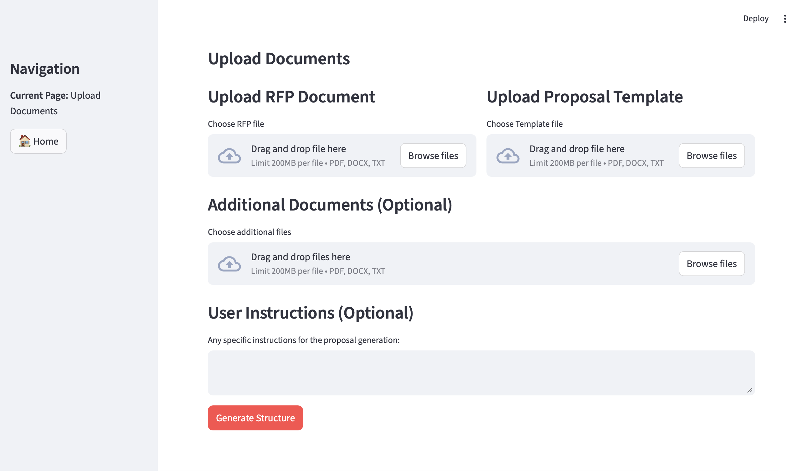

# LLM Proposal Composer (RAG + Agent Workflow)

## Overview

An **LLM-based proposal generation** system with a **structured LangGraph workflow**, document extraction (RFP / template), and a **Streamlit** UI for iterative human review before Word export.

## Problem

Manual proposal writing from RFPs is slow and inconsistent across deals.

## Solution

- **LangGraph** orchestrates a multi-step pipeline: extract → structure → user review → per-section generation → refinement → export.
- **RAG-style context**: prior sections and uploaded documents inform later generation.
- **Interactive UI** in Streamlit for approvals and feedback loops.

## Key Features

- Multi-step **agent workflow** (see `graph/graph.py` and `graph/nodes/`).
- **Iterative refinement** with user feedback on structure and sections.
- **Context-aware generation** using extracted text and conversation state.
- **Word export** via `python-docx`.

## Tech Stack

Python, LangGraph, LangChain, OpenAI API, Streamlit, PyPDF2, python-docx.

## Results

- Faster, more consistent proposal drafts with a clear audit trail of user approvals in the UI session.

## Demo

Streamlit UI (representative screen):



**Sample output:** [`docs/sample-generated-proposal.pdf`](docs/sample-generated-proposal.pdf) — synthetic / anonymized example of exported proposal content (not a real RFP or customer).

## Documentation

- `docs/proposal-writing-workflow.pdf` — proposal writing / workflow notes (exported from coursework).
- `docs/sample-generated-proposal.pdf` — sample generated proposal (illustrative export).
- `architecture/workflow-diagram.png` — LangGraph workflow diagram.

## Architecture (high level)


## Installation

```bash
pip install -r requirements.txt
cp .env.example .env
# Set OPENAI_API_KEY in .env
streamlit run streamlit_app.py
```

## File structure

```
├── functions/extract_text.py
├── graph/
│   ├── graph.py
│   ├── state.py
│   ├── consts.py
│   └── nodes/          # LangGraph nodes (structure, sections, export, …)
├── llm/
│   ├── llm_client.py
│   └── prompts.py
├── streamlit_app.py
├── main.py
├── requirements.txt
└── docs/
    ├── proposal-writing-workflow.pdf
    ├── sample-generated-proposal.pdf
    └── ui-screenshot.png
```

## API keys

Create `.env` from `.env.example` with your OpenAI API key.

## License

MIT License.
